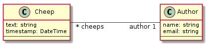
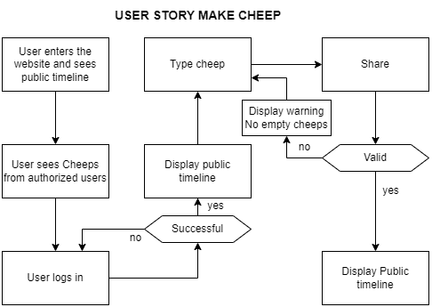
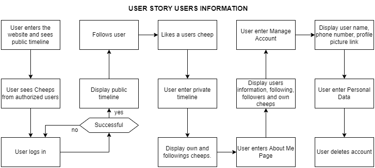

# Design and Architecture of _Chirp!_

## Domain model
<!---
Provide an illustration of your domain model. Make sure that it is correct and complete. In case you are using ASP.NET Identity, make sure to illustrate that accordingly.
-->
 
Here comes a description of our domain model.

## Architecture — In the small
<!---
Illustrate the organization of your code base. That is, illustrate which layers exist in your (onion) architecture. Make sure to illustrate which part of your code is residing in which layer.
-->

**Onion Architecture**

The chirp project is heavily inspired by the onion architecture, which is seen the general composition of the code. The code is split into three different layers, that are designed to operate independently from each other. These layers are as follows: 
A chirp core layer, that is the domain of the project. This layer is responsible for defining what the project is. The code for a cheep, like or a user is defined here. 
Furthermore the project has an infrastructure layer, that defines how data is handled and received by the application. True to the onion architecture, this layer is build upon the core layer, which means that infrastructure uses core and builds upon it. E.g there is a repository that handles cheeps from core. 
Lastly there exists a chirp web layer, that covers the razor pages and generally the frontend development of the project. Again true to onion architecture this layer uses core and infrastructure.

Having the project split up into separate layers is optimal for testing. Since they are loosely coupled the core of the project can be tested independently without the other layers. This makes a foundation for good testing. In addition this means that the outer layers can be modified without affecting the inner layers. This results in easy scalability and maintainability. All in all this architecture greatly benefits the project in the long run.

## Architecture of deployed application
<!---
Illustrate the architecture of your deployed application. Remember, you developed a client-server application. Illustrate the server component and to where it is deployed, illustrate a client component, and show how these communicate with each other.
-->

## User activities
<!---
Illustrate typical scenarios of a user journey through your Chirp! application. That is, start illustrating the first page that is presented to a non-authorized user, illustrate what a non-authorized user can do with your Chirp! application, and finally illustrate what a user can do after authentication.

Make sure that the illustrations are in line with the actual behavior of your application.
-->

As shown above, the user story begins by logging in and starting on the public timeline, where all cheeps are displayed, if the user wants to cheeps themselves they'll have to log in, either via. GitHub or just creating an account. Only if the login is successful will a user be able to type a cheep, and if the cheep is valid, it will be displayed on the public timeline like every other cheep.

The beginning of the user story is the same as in the make cheep diagram. The user logs in and gets to the public timeline. The user can then follow a user and like cheeps. When the user enters their own private timeline, it shows all of the cheeps from the users you follow. The user can then go to Manage account, and change their name, phone number, email, or profile picture. If the user wants to delete their data and profile, they can go to the Personal Data section and press Delete. 

## Sequence of functionality/calls trough _Chirp!_
<!---
With a UML sequence diagram, illustrate the flow of messages and data through your Chirp! application. Start with an HTTP request that is send by an unauthorized user to the root endpoint of your application and end with the completely rendered web-page that is returned to the user.

Make sure that your illustration is complete. That is, likely for many of you there will be different kinds of "calls" and responses. Some HTTP calls and responses, some calls and responses in C# and likely some more. (Note the previous sentence is vague on purpose. I want that you create a complete illustration.) FREE
-->

# Process

## Build, test, release, and deployment
<!---
Illustrate with a UML activity diagram how your Chirp! applications are build, tested, released, and deployed. That is, illustrate the flow of activities in your respective GitHub Actions workflows.

Describe the illustration briefly, i.e., how your application is built, tested, released, and deployed.
-->

The image above illustrates what happens when either a push is committed or a pull request i accepted. The first step of the yml, is running the command `dotnet restore`, this command restores the dependencies and tools of the project. Next step of the yml is running `dotnet build`, which then builds the project and its dependencies. After building the project, the yml then installs playwright, which is used for some of the tests, and is necessary for running test on GitHub. Final step of the yml is then running the command `dotnet test`, where all of the tests will run and show if any test will fail and which succeed.

When pushing to main, the procedure is a bit different. It does all the steps from the push UML diagram, but it also logins to Azure by using the Azure secrets and deploys Chirp to the Azure web service.

When making a release to github, it firstly runs `dotnet restore`, then it runs `dotnet build --no--restore`. It then installs playwright, and tests the program using `dotnet test`. It then makes zip files of the program, and makes a zip file for each operating system. It then releases it to github.

## Team work
<!---
Show a screenshot of your project board right before hand-in. Briefly describe which tasks are still unresolved, i.e., which features are missing from your applications or which functionality is incomplete.

Briefly describe and illustrate the flow of activities that happen from the new creation of an issue (task description), over development, etc. until a feature is finally merged into the main branch of your repository.
-->

<!--
HVAD SKAL TILFØJES HER??
 -->

All new features and enhancements are added as issues to the `ITU-BDSA2024-GROUP2 Chirp` backlog in GitHub. Issues follow the workflow as depicted above.

**Collaboration**

Depending on the extend of the task, each issue is assigned to the responsible person(s). When developing in teams we have made extensive use of pair programming as well as code reviews on an external monitor.

<!--
**Development**
During the development process we have followed a trunk-based branching strategy using short-lived feature branches for each issue.
RYK TIL ANDEN SEKTION
 -->

**Code reviews**
To ensure software quality and participation, all commits have undergone a review process from a team member who have not worked on the issue. We have used pull requests for this purpose.

## How to make _Chirp!_ work locally
<!---
There has to be some documentation on how to come from cloning your project to a running system. That is, Adrian or Helge have to know precisely what to do in which order. Likely, it is best to describe how we clone your project, which commands we have to execute, and what we are supposed to see then.
-->

To run the program locally, you will first have to clone the repository. Then you have to type in the secrets for the program. The secrets are as following:
ClientID: `Ov23li6lCKKhGGXefnEf`
ClientSecret: `460047215cdea005fd386c508c0ae3dc1412c20d`
Open the project in your terminal, and type the following command, and replace `<YOUR_CLIENTID>` with the ClientID. Then do the same for client secret:
`dotnet user-secrets set "authentication_github_clientId" "<YOUR_CLIENTID>"`
`dotnet user-secrets set "authentication_github_clientSecret" "<YOUR_CLIENTSECRET>"`

After the secrets have been set, cd into the src folder, and then cd into the src/Chirp.Web folder. From here you simply type `dotnet run`

## How to run test suite locally
<!---
List all necessary steps that Adrian or Helge have to perform to execute your test suites. Here, you can assume that we already cloned your repository in the step above.

Briefly describe what kinds of tests you have in your test suites and what they are testing.
-->

If you want to run the tests, you have to open the Chirp folder in the terminal. Then type `dotnet test`. If some tests are failing, try deleting the database from the src/Chirp.Web folder. Additionally check if there is a .db file in the test/Chirp.API.Tests/bin. If there is one, delete that too. Then run it again.

# Ethics

## Responsible handling of data
The project is made in accordance to european laws and regulations. The GDPR laws are therefor central to how the application handles data, which is why the user is able to delete their data permanently. In addition chirp does not store any unnecessary data about it's users - only the minimum to be able to distinguish users from each other. 

Users privacy is key, which is why chirp only operates under https to ensure that all communication with the users happens encrypted. Passwords in the database are also encrypted through hashing with ASP.NET Core Identity.

## License
<!---
State which software license you chose for your application.
-->
Chirp uses the MIT License. 

## LLMs, ChatGPT, CoPilot, and others
<!---
State which LLM(s) were used during development of your project. In case you were not using any, just state so. In case you were using an LLM to support your development, briefly describe when and how it was applied. Reflect in writing to which degree the responses of the LLM were helpful. Discuss briefly if application of LLMs sped up your development or if the contrary was the case. 
-->
During the preparation of Chirp we have used ChatGPT to assist our development and learning process. In general we have been very cautious with our consumption of ChatGPT and always consulted the official documentation, TAs or websites like Stack Overflow first. The primary goal and intend by using a LLM is to improve our understanding of the course material and frameworks used. We think that the responses from ChatGPT was especially helpful in understanding complex concepts. Contrary we think that responses from ChatGPT was not very helpful in speeding up development as it overcomplicates many aspects an does not have a deep understanding of our domain model like we do ourselves.

