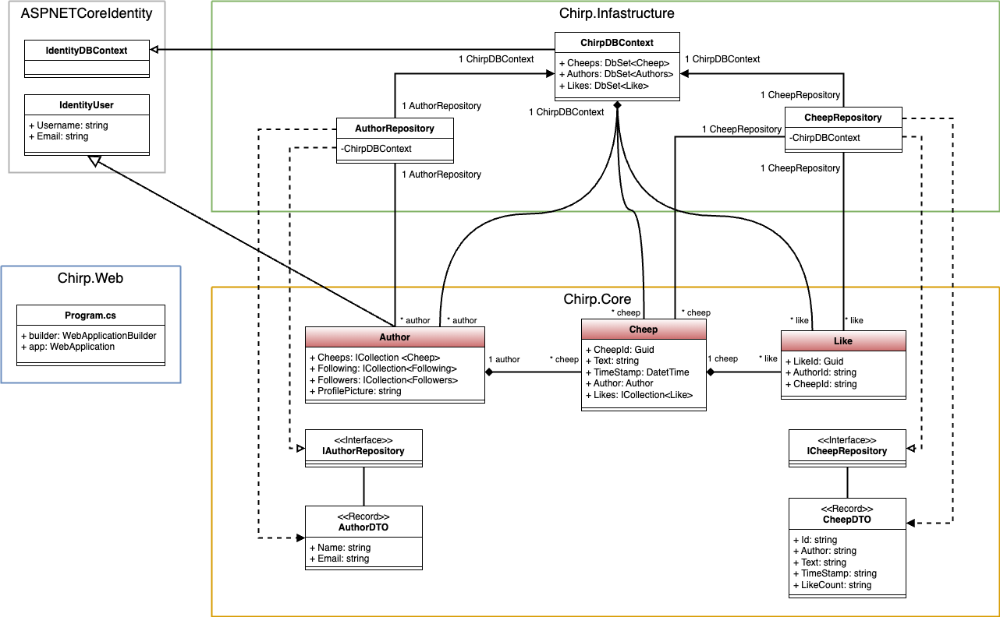
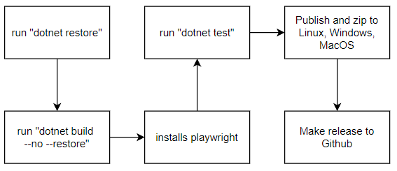
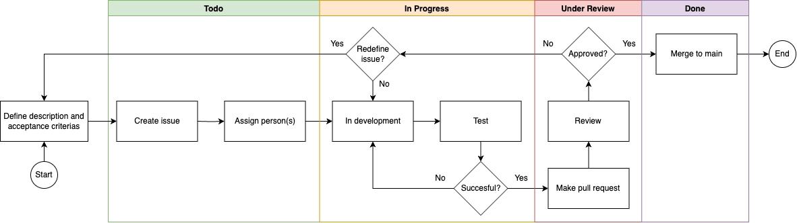

# Design and Architecture of _Chirp!_

## Domain model

\newpage

## Architecture — In the small

**Onion Architecture**

The _Chirp!_ project implements the onion architecture, which is seen in the composition of the code. The code is split into three different layers:

- A chirp **core** layer, that contains the domain model of the project.

- A chirp **infrastructure** layer, that is responsible for manipulation and retrieval of data. True to the onion architecture, this layer is built upon the **core** layer, which means that **infrastructure** depends on **core**.

- A chirp **web** layer, that is responsible for the UI of the project. Again, true to onion architecture this layer depends on **core** and **infrastructure**.

{ width=60% }

Having the project split up into separate layers is optimal for testing. Since the layers are loosely coupled the core of the project can be tested independently. This makes a foundation for good testing. In addition this means that the outer layers can be modified without affecting the inner layers. This results in easy scalability and maintainability. All in all this architecture greatly benefits the project in the long run.

## Architecture of deployed application

The application follows a client-server architecture. The server is a web application deployed on Azure App Service. It provides the necessary interface and API endpoints for communication with the client.

## User activities

Below are illustrated examples of different user activities.

## Sequence of functionality/calls through _Chirp!_

The diagram of sequences shown below illustrates a sequence of calls in the _Chirp!_ application initiated by a user, for both an unauthenticated and an authenticated user.

\newpage

# Process

## Build, test, release, and deployment

**Build and test**

The image below illustrates what happens when either a commit is pushed or a pull request is made.

- `dotnet restore`, restores the dependencies and tools of the project.

- `dotnet build`, builds the project and its dependencies. 

- Installs PlayWright, which is necessary for running PlayWright tests on GitHub.

- `dotnet test`, where all of the tests will run and show if any test will fail and which succeed.

{ width=60% }
 

**Deployment**

When pushing to main, the build and test flows are run. It also logs in to Azure by using the Azure secrets and deploys Chirp to the Azure web service.

{ width=60% }
 
\newpage

**Release**

When pushing with a new tag, a release is made to GitHub:

- The application is published for Windows, Linux and MacOS.

- The artifacts for each publish is zipped to its own zip file

- The zip files are released to GitHub under a new release.

{ width=80% }
 

## Team work

All issues related to the mandatory project work as well as our own extra features are done.

**From issue to main**

All new features and enhancements are added as issues to the `ITU-BDSA2024-GROUP2 Chirp` backlog in GitHub. Issues follow the workflow as depicted below until they are merged to the main branch and deployed to Azure.
\newpage

**Collaboration**

Depending on the extend of the task, each issue is assigned to the responsible person(s). When developing in teams we have made extensive use of pair programming as well as code reviews on an external monitor.

**Code reviews**

To ensure software quality and participation, commits have undergone a review process from a team member who have not worked on the issue. We have used pull requests for this purpose.

## How to make _Chirp!_ work locally

**Running _Chirp!_ locally**

1. Clone the repository by running the following command: `git clone https://github.com/ITU-BDSA2024-GROUP2/Chirp.git`

2. Setup program secrets.

    2.1. Go to the root of the project: `/Chirp`

    2.2. Type the following commands:

    **ClientID:** `dotnet user-secrets set "authentication_github_clientId" "Ov23li6lCKKhGGXefnEf"`

    **ClientSecret:** `dotnet user-secrets set "authentication_github_clientSecret" "460047215cdea005fd386c508c0ae3dc1412c20d"`

3. Cd into the folder: `Chirp/src/Chirp.Web`

4. Type: `dotnet run`

**Note:** You have to use dotnet 8 for the program to function properly.
\newpage

## How to run test suite locally

**Running _Chirp!_ tests locally**

1. Cd into the folder: `Chirp/src/Chirp.Web`

2. Run the following command: `pwsh bin/Debug/net8.0/playwright.ps1 install --with-deps`

3. Go to the root of the project: `/Chirp`

2. Type: `dotnet test` 

**Note:** If some tests fail the database file might be deprecated. To fix this delete the database file from the `src/Chirp.Web` folder. Additionally check if there is a .db file in the `test/Chirp.API.Tests/bin`. If there is one, delete that too. Then run the tests again.

The test suites contain the following tests:

**UNIT tests** 

Testing individual methods in isolation. E.g. creating a new cheep or author in the database.

**INTEGRATION tests** 

Testing a combination of methods or a component of the website. E.g. testing that liking a cheep stores the like in the database.

**END TO END tests** 

Testing a complete user journey through the application. E.g. logging in, making a cheep, and having the cheep displayed in the respective authors private timeline.

**UI tests** 

Made using PlayWright. Testing and simulating user interactions and navigation through the user interface. E.g. testing that the submit button is accessible when sharing a cheep.

# Ethics
## License

_Chirp!_ uses the MIT License. 

## LLMs, ChatGPT, CoPilot, and others

During the preparation of _Chirp!_ we have used ChatGPT to assist our development and learning process. In most cases we have been cautious with our usage of ChatGPT and always consulted the official documentation, TAs or websites like Stack Overflow first. 

The primary goal and intend of using an LLM is to improve our understanding of the course material and frameworks used. We think that the responses from ChatGPT were especially helpful in understanding complex concepts. Contrary, responses from ChatGPT were not very helpful in speeding up development. It overcomplicates many aspects and does not have a deep understanding of our domain model like we do ourselves.