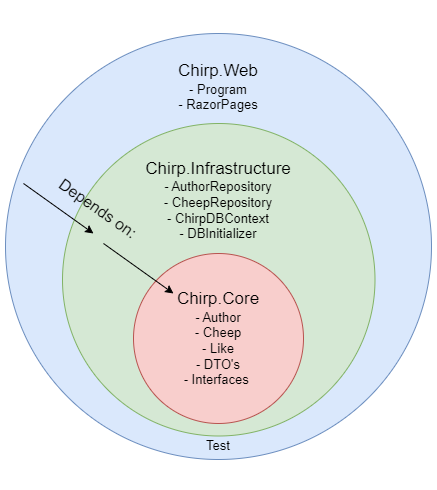
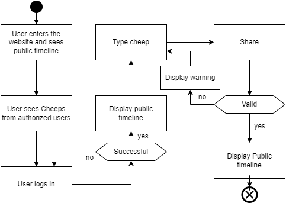
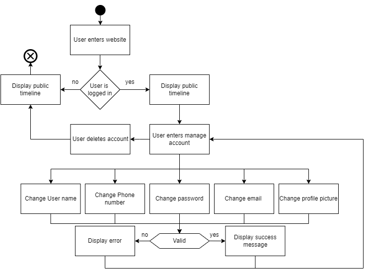
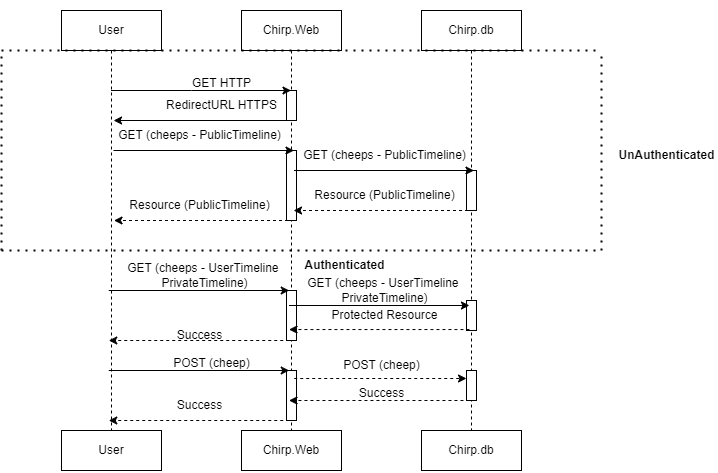

# Introduction to Chirp

# Design and Architecture of _Chirp!_

## Domain model
<!---
Provide an illustration of your domain model. Make sure that it is correct and complete. In case you are using ASP.NET Identity, make sure to illustrate that accordingly.
-->
Here comes a description of our domain model.

## Architecture — In the small
<!---
Illustrate the organization of your code base. That is, illustrate which layers exist in your (onion) architecture. Make sure to illustrate which part of your code is residing in which layer.
-->

**Onion Architecture**

The Chirp! project implements the onion architecture, which is seen in the composition of the code. The code is split into three different layers:
* A chirp **core** layer, that is the domain of the project, and how it differentiates from other programs.
* A chirp **infrastructure** layer, that is responsible for manipulation and retrieval of data. True to the onion architecture, this layer is built upon the **core** layer, which means that **infrastructure** depends on **core**. 
* A chirp **web** layer, that is responsible for the UI of the project. Again, true to onion architecture this layer depends on **core** and **infrastructure**.

Having the project split up into separate layers is optimal for testing. Since they are loosely coupled the core of the project can be tested independently without the other layers. This makes a foundation for good testing. In addition this means that the outer layers can be modified without affecting the inner layers. This results in easy scalability and maintainability. All in all this architecture greatly benefits the project in the long run.

## Architecture of deployed application
<!---
Illustrate the architecture of your deployed application. Remember, you developed a client-server application. Illustrate the server component and to where it is deployed, illustrate a client component, and show how these communicate with each other.
-->

The application follows a client-server architecture. The server is a web application deployed on Azure App Service. It provides the necessary interface and API endpoints for communication with the client.

<!--
Evt. tilføj web, infrastructure, core til billede
Evt. tilføj at brugeren ikke interegere direkte med databasen, men gennem et interface.
-->

## User activities
<!---
Illustrate typical scenarios of a user journey through your Chirp! application. That is, start illustrating the first page that is presented to a non-authorized user, illustrate what a non-authorized user can do with your Chirp! application, and finally illustrate what a user can do after authentication.

Make sure that the illustrations are in line with the actual behavior of your application.
-->

{ width=80% }

{ width=80% }

{ width=80% }

## Sequence of functionality/calls through _Chirp!_
<!---
With a UML sequence diagram, illustrate the flow of messages and data through your Chirp! application. Start with an HTTP request that is send by an unauthorized user to the root endpoint of your application and end with the completely rendered web-page that is returned to the user.

Make sure that your illustration is complete. That is, likely for many of you there will be different kinds of "calls" and responses. Some HTTP calls and responses, some calls and responses in C# and likely some more. (Note the previous sentence is vague on purpose. I want that you create a complete illustration.)
-->

The diagram of sequences shown below illustrates a sequence of calls in the Chirp application initiated by the user, for both an unauthenticated user and an authenticated user.

# Process

## Build, test, release, and deployment
<!---
Illustrate with a UML activity diagram how your Chirp! applications are build, tested, released, and deployed. That is, illustrate the flow of activities in your respective GitHub Actions workflows.

Describe the illustration briefly, i.e., how your application is built, tested, released, and deployed.
-->

**Build and test**

The image below illustrates what happens when either a push is committed or a pull request is made.
  * `dotnet restore`, this command restores the dependencies and tools of the project.
  * `dotnet build`, which then builds the project and its dependencies. 
  * The yml installs playwright, which is necessary for running test on GitHub.
  * `dotnet test`, where all of the tests will run and show if any test will fail and which succeed.

{ width=50% }

**Deployment**
When pushing to main, the build and test flows are run. It also logs in to Azure by using the Azure secrets and deploys Chirp to the Azure web service.

{ width=50% }

**Release**
When pushing with a new tag, a release is made to GitHub:
* The application is published for Windows, Linux and MacOS.
* The artifacts for each publish is zipped to its own zip file
* The zip files are released to GitHub under a new release.

{ width=50% }

## Team work
<!---
Show a screenshot of your project board right before hand-in. Briefly describe which tasks are still unresolved, i.e., which features are missing from your applications or which functionality is incomplete.

Briefly describe and illustrate the flow of activities that happen from the new creation of an issue (task description), over development, etc. until a feature is finally merged into the main branch of your repository.
-->
All issues related to the mandatory project work as well as our own extra features are done.

**From issue to main**
All new features and enhancements are added as issues to the `ITU-BDSA2024-GROUP2 Chirp` backlog in GitHub. Issues follow the workflow as depicted below until they are merged to the main branch and deployed to Azure.

**Collaboration**
Depending on the extend of the task, each issue is assigned to the responsible person(s). When developing in teams we have made extensive use of pair programming as well as code reviews on an external monitor.

**Code reviews**
To ensure software quality and participation, commits have undergone a review process from a team member who have not worked on the issue. We have used pull requests for this purpose.

## How to make _Chirp!_ work locally
<!---
There has to be some documentation on how to come from cloning your project to a running system. That is, Adrian or Helge have to know precisely what to do in which order. Likely, it is best to describe how we clone your project, which commands we have to execute, and what we are supposed to see then.
-->
**Running _Chirp!_ locally**

1. Clone the repository by running the following command `git clone https://github.com/ITU-BDSA2024-GROUP2/Chirp.git`.

2. Setup program secrets.

    2.1. Go to the root of the project `/Chirp`.

    2.2. Type the following command:

**ClientID:** `dotnet user-secrets set "authentication_github_clientId" "Ov23li6lCKKhGGXefnEf"`

**ClientSecret:** `dotnet user-secrets set "authentication_github_clientSecret" "460047215cdea005fd386c508c0ae3dc1412c20d"`
3. Cd into the folder `Chirp/src/Chirp.Web`.
4. Type `dotnet run`. 

**Note:** You have to use dotnet 8 for the program to function properly.

## How to run test suite locally
<!---
List all necessary steps that Adrian or Helge have to perform to execute your test suites. Here, you can assume that we already cloned your repository in the step above.

Briefly describe what kinds of tests you have in your test suites and what they are testing.
-->
**Running _Chirp!_ tests locally**

1. Cd into the folder `Chirp/src/Chirp.Web`.
2. Run the following command `pwsh bin/Debug/net8.0/playwright.ps1 install --with-deps`.
3. Go to the root of the project `/Chirp`.
2. Type `dotnet test`. 

**Note:** If some tests are failing, try deleting the database from the `src/Chirp.Web` folder. Additionally check if there is a .db file in the `test/Chirp.API.Tests/bin`. If there is one, delete that too. Then run the tests again.

There are four kinds of tests:
* **UNIT tests** are testing 1 method or one feature. This could be testing changing profile picture.
* **INTEGRATION tests** are testing a combination of methods, or a component of the website. This could be testing the register form.
* **END TO END tests** are testing a full user experience. This could be making a profile, sending a cheep and entering the private timeline.
* **UI tests** were made using playwright, for easy navigation through the UI elements.

# Ethics
## License
<!---
State which software license you chose for your application.
-->
Chirp uses the MIT License. 

## LLMs, ChatGPT, CoPilot, and others
<!---
State which LLM(s) were used during development of your project. In case you were not using any, just state so. In case you were using an LLM to support your development, briefly describe when and how it was applied. Reflect in writing to which degree the responses of the LLM were helpful. Discuss briefly if application of LLMs sped up your development or if the contrary was the case. 
-->
During the preparation of Chirp we have used ChatGPT to assist our development and learning process. In most cases we have been cautious with our usage of ChatGPT and always consulted the official documentation, TAs or websites like Stack Overflow first. 

The primary goal and intend of using an LLM is to improve our understanding of the course material and frameworks used. We think that the responses from ChatGPT were especially helpful in understanding complex concepts. Contrary, responses from ChatGPT were not very helpful in speeding up development as it overcomplicates many aspects and does not have a deep understanding of our domain model like we do ourselves.

